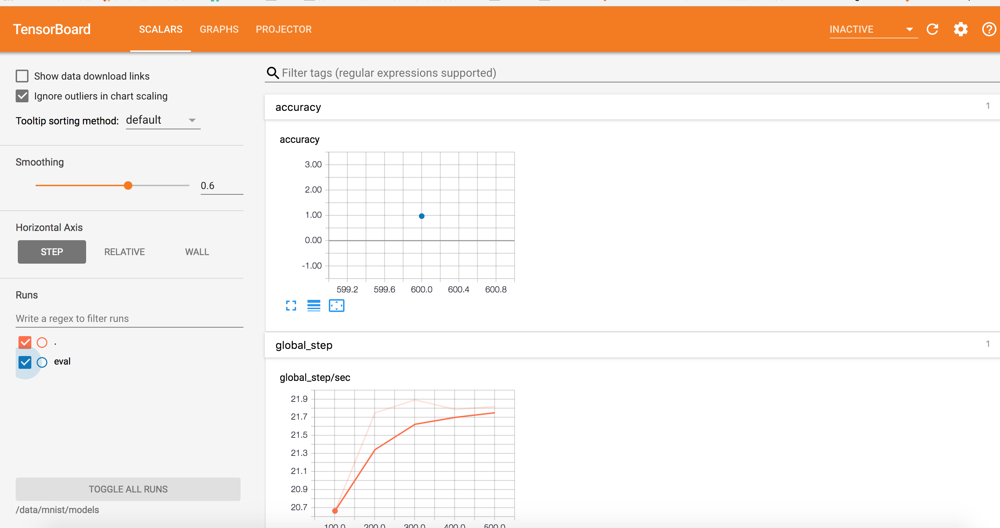

You can also use high-level TensorFlow API – tf.estimator.Estimator class – for running Distributed TensorFlow with good modularity by using `Arena`.

1. Create Persistent Volume. Moidfy `NFS_SERVER_IP` to yours.

```
# cat nfs-pv.yaml
apiVersion: v1
kind: PersistentVolume
metadata:
  name: tfdata
  labels:
    tfdata: nas-mnist
spec:
  persistentVolumeReclaimPolicy: Retain
  capacity:
    storage: 10Gi
  accessModes:
  - ReadWriteMany
  nfs:
    server: NFS_SERVER_IP
    path: "/data"
    
 # kubectl create -f nfs-pv.yaml
```

2\. Create Persistent Volume Claim. 

```
# cat nfs-pvc.yaml
apiVersion: v1
kind: PersistentVolumeClaim
metadata:
  name: tfdata
  annotations:
    description: "this is the mnist demo"
    owner: Tom
spec:
  accessModes:
    - ReadWriteMany
  resources:
    requests:
       storage: 5Gi
  selector:
    matchLabels:
      tfdata: nas-mnist
# kubectl create -f nfs-pvc.yaml
```

> Notice: suggest to add `description` and `owner`

3\. Check the data volume

```
# arena data list 
NAME    ACCESSMODE     DESCRIPTION             OWNER   AGE
tfdata  ReadWriteMany  this is for mnist demo  myteam  43d
```

4\. To run a distributed Tensorflow Training, you need to specify:

 - GPUs of each worker (Include chief and evaluator)
 - Enable chief (required)
 - Enable Evaluator (optional)
 - The number of workers (required)
 - The number of PS (required)
 - The docker image of worker and master (required)
 - The docker image of PS (required)
 - The Port of Chief (default is 22221)
 - The Port of Worker (default is 22222)
 - The Port of PS (default is 22223)

The following command is an example. In this example, it defines 1 chief worker, 1 workers, 1 PS and 1 evaluator, and each worker has 1 GPU. The source code of worker and PS are located in git, and the tensorboard are enabled.

```
# arena submit tf --name=tf-estimator              \
              --gpus=1              \
              --workers=1             \
              --chief                  \
              --evaluator              \
              --data=tfdata:/data/mnist     \
              --logdir=/data/mnist/models \
              --workerImage=tensorflow/tensorflow:1.9.0-devel-gpu  \
              --syncMode=git \
              --syncSource=https://github.com/cheyang/models.git \
              --ps=1              \
              --psImage=tensorflow/tensorflow:1.9.0-devel   \
              --tensorboard \
              "bash code/models/dist_mnist_estimator.sh --data_dir=/data/mnist/MNIST_data  --model_dir=/data/mnist/models"
NAME:   tf-estimator
LAST DEPLOYED: Tue Sep 25 06:37:01 2018
NAMESPACE: default
STATUS: DEPLOYED

RESOURCES:
==> v1alpha2/TFJob
NAME                AGE
tf-estimator-tfjob  0s

``` 

> `--data` specifies the data volume to mount to all the tasks of the job, like <name_of_datasource>:<mount_point_on_job>. In this example, the data volume is `tfdata`, and the target directory is `/data/mnist`.


5\. From the logs, we have found the training is started

```
# arena logs tf-estimator
2018-09-27T00:37:01.576672145Z 2018-09-27 00:37:01.576562: I tensorflow/core/common_runtime/gpu/gpu_device.cc:1084] Created TensorFlow device (/job:chief/replica:0/task:0/device:GPU:0 with 15123 MB memory) -> physical GPU (device: 0, name: Tesla P100-PCIE-16GB, pci bus id: 0000:00:08.0, compute capability: 6.0)
2018-09-27T00:37:01.578669608Z 2018-09-27 00:37:01.578523: I tensorflow/core/distributed_runtime/rpc/grpc_channel.cc:215] Initialize GrpcChannelCache for job chief -> {0 -> localhost:22222}
2018-09-27T00:37:01.578685739Z 2018-09-27 00:37:01.578550: I tensorflow/core/distributed_runtime/rpc/grpc_channel.cc:215] Initialize GrpcChannelCache for job ps -> {0 -> tf-estimator-tfjob-ps-0:22223}
2018-09-27T00:37:01.578705274Z 2018-09-27 00:37:01.578562: I tensorflow/core/distributed_runtime/rpc/grpc_channel.cc:215] Initialize GrpcChannelCache for job worker -> {0 -> tf-estimator-tfjob-worker-0:22222}
2018-09-27T00:37:01.579637826Z 2018-09-27 00:37:01.579454: I tensorflow/core/distributed_runtime/rpc/grpc_server_lib.cc:334] Started server with target: grpc://localhost:22222
2018-09-27T00:37:01.701520696Z I0927 00:37:01.701258 140281586534144 tf_logging.py:115] Calling model_fn.
2018-09-27T00:37:02.172552485Z I0927 00:37:02.172167 140281586534144 tf_logging.py:115] Done calling model_fn.
2018-09-27T00:37:02.173930978Z I0927 00:37:02.173732 140281586534144 tf_logging.py:115] Create CheckpointSaverHook.
2018-09-27T00:37:02.431259294Z I0927 00:37:02.430984 140281586534144 tf_logging.py:115] Graph was finalized.
2018-09-27T00:37:02.4472109Z 2018-09-27 00:37:02.447018: I tensorflow/core/distributed_runtime/master_session.cc:1150] Start master session b0a6d2587e64ebef with config: allow_soft_placement: true graph_options { rewrite_options { meta_optimizer_iterations: ONE } }
...
2018-09-27T00:37:33.250440133Z I0927 00:37:33.250036 140281586534144 tf_logging.py:115] global_step/sec: 21.8175
2018-09-27T00:37:33.253100942Z I0927 00:37:33.252873 140281586534144 tf_logging.py:115] loss = 0.09276967, step = 500 (4.583 sec)
2018-09-27T00:37:37.764446795Z I0927 00:37:37.764101 140281586534144 tf_logging.py:115] Saving checkpoints for 600 into /data/mnist/models/model.ckpt.
2018-09-27T00:37:38.064104604Z I0927 00:37:38.063472 140281586534144 tf_logging.py:115] Loss for final step: 0.24215397.
```

6\. Check the training status and tensorboard

```
# arena get tf-estimator
NAME          STATUS     TRAINER  AGE  INSTANCE                        NODE
tf-estimator  SUCCEEDED  TFJOB    5h   tf-estimator-tfjob-chief-0      N/A
tf-estimator  RUNNING    TFJOB    5h   tf-estimator-tfjob-evaluator-0  192.168.1.120
tf-estimator  RUNNING    TFJOB    5h   tf-estimator-tfjob-ps-0         192.168.1.119
tf-estimator  RUNNING    TFJOB    5h   tf-estimator-tfjob-worker-0     192.168.1.118

Your tensorboard will be available on:
192.168.1.117:31366
```

7\. Check the tensorboard from 192.168.1.117:31366 in this sample


